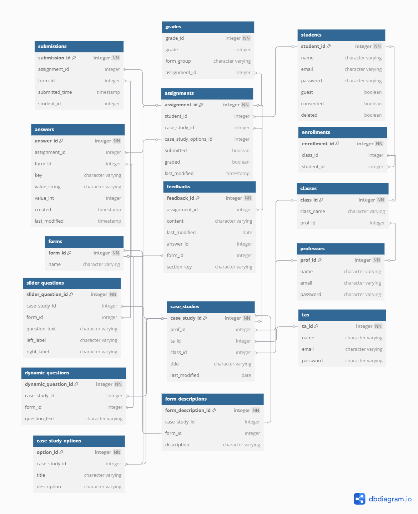
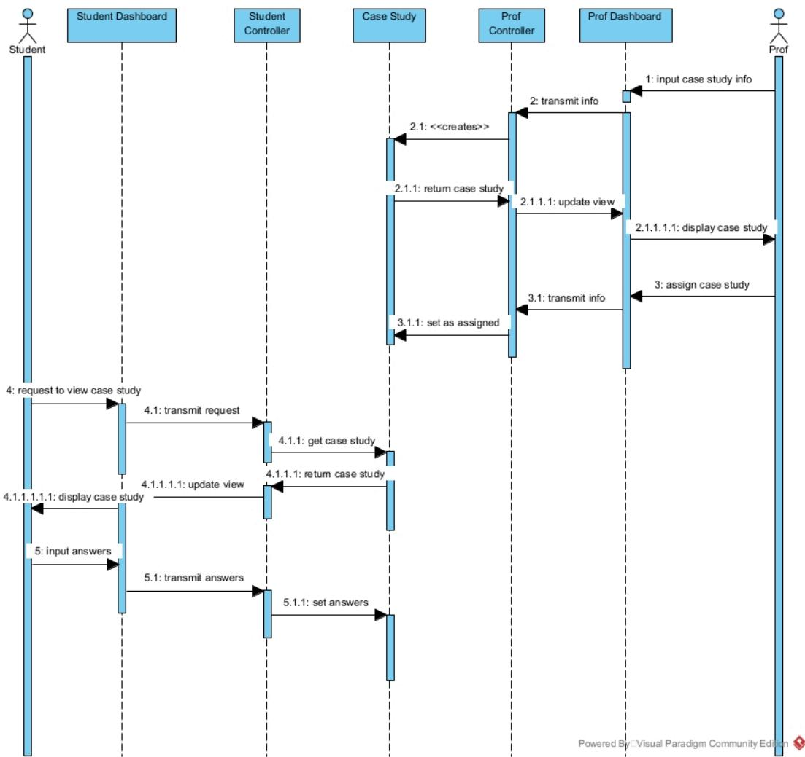

# Ethics Dashboard Student Side Developer Guide

April 2025

Developers: Keona Gagnier Fir Bolken Cody Jorgenson

# Table of Contents

- [Project Description](#project-description)  
- [Install the Project](#install-the-project)  
- [Run the Project Development Environment](#run-the-project-development-environment)  
- [Setting up the Database](#setting-up-the-database)  
- [Link to API Documentation](#link-to-api-documentation)  
- [Architecture](#architecture)  
  - [Model](#model)  
  - [View](#view)  
  - [Controller](#controller)  
- [DB Diagram](#db-diagram)  
- [Tables Overview](#tables-overview)  
  1. [Submissions](#submissions)  
  2. [Grades](#grades)  
  3. [Students](#students)  
  4. [Assignments](#assignments)  
  5. [Answers](#answers)  
  6. [Enrollments](#enrollments)  
  7. [Classes](#classes)  
  8. [Forms](#forms)  
  9. [Professors](#professors)  
  10. [TAs (Teaching Assistants)](#tas-teaching-assistants)  
  11. [Case Studies](#case-studies)  
  12. [Case Study Options](#case-study-options)  
  13. [Slider Questions](#slider-questions)  
  14. [Dynamic Questions](#dynamic-questions)  
  15. [Form Descriptions](#form-descriptions)  
  16. [Feedbacks](#feedbacks)  
    - [Section Key Values](#section-key-values)  
- [Sequence Diagram](#sequence-diagram)  
- [How to Add a Model](#how-to-add-a-model)  
- [How to Add a Controller/API Route](#how-to-add-a-controllerapi-route)  
- [How to Add a View](#how-to-add-a-view)  
- [How to Create and Run Tests](#how-to-create-and-run-tests)  
- [Using the Server and Deployment](#using-the-server-and-deployment)  


# Project Description

The **Ethics Dashboard** is a responsive web application designed to facilitate ethical decision-making for students, instructors, and teaching assistants. It provides a structured framework to analyze ethical dilemmas through visual and interactive tools.

## **Key Features:**

- 1. **Ethics Dashboard**: A central hub presenting a visual summary of ethical analyses and inputs in real-time.
- 2. **Ethical Analysis Framework**: Guides users through a structured Seven-Step Framework for decision-making.
- 3. **Global Ethical Lenses**: Includes both Western and non-Western ethical theories, emphasizing diverse perspectives.
- 4. **Self-Reflection Tools**: Encourages evaluation using universal ethical principles to build personal and global ethical awareness.
- 5. **Instructor Feedback**: Allows instructors to assess student progress, provide feedback, and assign grades.
- 6. **User-Friendly Interface**: Features guided prompts, step-by-step inputs, and a clean navigation system for seamless usability.
- 7. **Secure Accounts**: Supports user authentication and integration with learning platforms (e.g., Moodle).

## **Scope:**

- **Student Workflow**: Input ethical dilemmas, analyze using various frameworks, and generate comprehensive reports.
- **Instructor Workflow**: Evaluate student work through dashboards and detailed reports.
- **Backend Logic**: Stores user data, executes framework logic, and ensures secure data handling.

## **Project Timeline:**

- **Dec 1**: Ethics Dashboard prototype with partial functionality.
- **Mar 1**: Fully functional application ready for testing.
- **Apr 1**: Final revisions based on feedback.
- **End of Term**: Launch for use in applied ethics courses.

By combining interactive learning with comprehensive ethical analysis tools, the **Ethics Dashboard** aims to enhance ethical education through an engaging and globally inclusive approach.


# Install the Project

You must have the following installed as prerequisites:

- Docker
- Python

You can download the project files from Keona Gagnier's GitHub repo, titled [COSC470-project](https://github.com/KeonaKohorst/COSC470-project). Clone the repository locally on your device.

The repo is private at the time of writing this, you may need to request access.

If the link is broken, the GitHub username is KeonaKohorst. You can also reach Keona by her email at [kohorstkeona@outlook.com,](mailto:kohorstkeona@outlook.com) and she can help you get access.

I recommend installing the project in your root C:/ folder for easy access.


# Run the Project Development Environment

Navigate to the COSC470-project directory via command line and run the following commands to build and start the Docker containers:

```sh
docker-compose build
docker-compose up
```

then navigate to localhost:3000 in your browser to see the log in page.

## Running the Frontend Development Environment
At the time of writing this, when the `nextapp` container is running (the frontend container), and you try to log in it will give you an error (this is because it is trying to contact the server due to how we set up the code, and this won't work for the development environment).

So, to run the frontend development environment, stop the `nextapp` container (leave the rest running), then navigate to /COSC470-project/frontend and run:

```sh
pnpm i
pnpm dev
```

This will start the next.js development environment, and you should now be able to log in on localhost:3000.


# Setting up the Database
Since you just created your database, it will be empty, so you will need to create an account first.

- Remember that students have to be invited to create an account, so you have to manually put in the students email into the database Students table (or use the Professor side to invite a student).

## Accessing the Database
To access the postgres database, execute the following command in the `COSC470-project` directory:

```sh
docker exec -it db psql -U postgres
```
## How to populate DB with the DB dump

The file in the root of the project titled `dml_dump.sql` contains dummy data.

To populate the database using this file, follow these steps:

### 1. Copy `dml_dump.sql` from Host to the Database Container
  - Run this command on your host system to copy the SQL dump file into the container:
```sh
docker cp C:/COSC470-project/dml_dump.sql db:/tmp/dml_dump.sql
```

### 2. Access the Database Container Terminal Start an interactive shell session inside the database container:
```sh
docker exec -it db bash
```

### 3. Import the DML Dump into PostgreSQL

Once inside the container, use the following command to populate the database:
```sh
psql -U postgres -d postgres -f /tmp/dml_dump.sql
```

### 4. Exit the Container

After the import is complete, exit the container:
```sh
exit
```


# Link to API Documentation

Link to Google Doc with View Privileges:
[API Documentation Google Doc](https://docs.google.com/document/d/1-LKPILFQ2KaHWk946qvGyyi8oyqLXLxAO17ih_YQP50/edit?usp=sharing)
Note that it is on page 7 of the document.

Link to POSTMAN:
**[API documentation](https://restless-robot-70850.postman.co/workspace/a6c42954-0266-45ad-8e38-7752bda16afa/collection/39425129-5764d51a-c83a-406c-89e0-abb79ce4e8f8)**

You may need to request access for postman. 

**Can't wait for access?**
View the [COSC470-project](https://github.com/Okanagan-College-COSC470-Fall-2024/the-project-team-3) GitHub Repo and download the API documentation file from the "documentation" folder in the root of the project and import it to [Postman](https://www.postman.com/).

If you are struggling with Postman, you can also just look at the Controllers file in the backend and look at the routes in there. It is less straightforward but it will give you the same information.


# Architecture

MVC - Model View Architecture The backend folder holds the Model and Controllers while the frontend folder holds the Views.

## Model

We are using SQLAlchemy in our Flask app as our ORM (Object Relational Mapping). We have created classes for each entity in our database. All models are in the Model file in the backend folder.

## View

We are using Next.js for our frontend. Each file titled "page.tsx" is a view. All views are in the /frontend/app folder.

## Controller

We are using API calls (routes) to handle information flow from the database to the frontend, all of our controllers are in the Controller file in the backend folder.

# DB Diagram

#### Link to view [diagram](https://dbdiagram.io/d/EthicsDashboard-67b7a246263d6cf9a0eb57cc) online



## Tables Overview

### Submissions

  - Holds information for a submitted assignment.

### Grades

- Holds the grades for an assignment.
- **Form group** contains the following possible values:
	- Seven Step Method
	- Consequences
	- Role
	- Past Actions
	- Reason
	- Care Ethics
	- Intersectionality
	- Seven Generations
	- Virtue Ethics
	- Life Path
	- Universal Principles
- *Note: Creating a form\_group table might be a good improvement to the database.*

### Students

  - Stores student information.

### Assignments

  - Represents an assigned case study, associated with a student.

### Answers

  - Stores the answers submitted for an assignment.

### Enrollments

  - Captures the relationship between classes and students.

### Classes

  - Stores information about classes.

### Forms

  - Holds form names and their corresponding IDs.

### Professors

  - Stores professor information.

### TAs

  - Stores TA information.

### Case Studies

- Holds templates for case studies.
- When a professor creates a case study with custom questions, it is stored here.
- Assignments pull particular case study templates from this table.

### Case Study Options

- Each case study has several options for the "Case" the student can analyze.
- These options are stored here.

### Slider Questions

  - Stores custom slider-type questions created by professors.

### Dynamic Questions

  - Stores custom text input questions created by professors.

### Form Descriptions*

- Some forms have an introductory paragraph.
- Professors can edit and add links.
- This content is pulled from this table.

### Feedbacks

- Holds professor comments associated with a particular assignment and form.
- Has a section_key column which represents which section of the form the feedback is for.

#### Section Key Values
`section_key` represents which part of a form the comment is for.

Valid values for `section_key` (organized by the form they're for) include:

##### Seven Step Method

- `select-dilemma` Comment box for selecting the dilemma at the top of the form.
- `test-options` Comment box for the test options section.
- `tentative-choice` Comment box for the tentative-choice section.
- `dilemma` Comment box for the whole form.

##### Relations

###### Care Ethics

- `care-form-stakeholders` Comment box for stakeholders section of Care Ethics form.
- `care-form` Comment box for the whole Care Ethics form.

###### Intersectionality

- `stakeholder-feedback-\${index}` Feedback for a stakeholder in the intersectionality form.
- `intersect-form` Feedback for the whole intersectionality form.

###### Seven Generations

- `generations-stakeholders` Comment box for the stakeholders section.
- `generations-form` Comment box for the whole form.

##### Consequences

###### Stakeholders

- `stakeholder-analysis` Comment box for stakeholder analysis in the Stakeholders form.
- `cons-stakeholders` Comment box for the whole Stakeholders form.

###### Utilitarianism

- `cons-util-bentham` Feedback for the whole Bentham form.
- `cons-util-mill` Feedback for the whole Mill form.

###### Action and Duty

###### Reason

- `critical-questions` Comment box for the whole critical questions form.
- `categorical-imperatives` Comment box for the whole Categorical Imperatives form.

###### Roles

- `moral-duties` Comment box for the moral duties section.
- `personal-sacrifices` Comment box for the whole form.

###### Past Actions

- `duties-sliders` Feedback for sliders on the Past Actions form.
- `duties-versus-actions` Comment box for the whole form.

##### Character and Virtue

###### Virtue Ethics

- `domains` Feedback for the domains section.
- `virtue-ethics` Feedback for the whole form.

###### Life Path

- `life-path-sliders` Feedback for sliders on the Life Path form.
- `life-path` Feedback for the whole form.

###### Universal Principles

- `up-sliders` Feedback for the sliders.
- `universal-principles` Feedback for the whole form.


# Sequence Diagram

Interaction with Professor side through the shared DB.




# How to add a model

## 1. Define the model

Create a new Python file in your models directory (e.g., `backend/models/my_model.py`) and define the model using SQLAlchemy.

```python
Example:
from .db import db, ma
class MyModel(db.Model):
    __tablename__ = "my_models" # Replace with your table name
    id = db.Column("id", db.Integer, primary_key=True)
    name = db.Column("name", db.String, nullable=False)
    def __init__(self, name):
        self.name = name
    def json(self):
        return {'id': self.id, 'name': self.name}
    def __repr__(self):
        return f"MyModel({self.id}, {self.name})"
    @classmethod
    def get_by_id(cls, id):
        return cls.query.filter(cls.id == id).first()
    @classmethod
    def get_by_name(cls, name):
        return cls.query.filter(cls.name == name).first()
```
## 2. Create a Schema for Marshmallow

To serialize and deserialize the model, create a schema using Marshmallow.

```python
class MyModelSchema(ma.SQLAlchemyAutoSchema):
    class Meta:
        model = MyModel
        session = db.session
        load_instance = True
```
## 3. Register the model in `__init__.py`

To ensure the model is recognized by the application, add an import in the `models/__init__.py` file.

```python
from .my_model import MyModel, MyModelSchema
```

Then, add MyModel and MyModelSchema to `__all__`:

```python
__all__ = [
    # Other models...
    'MyModel',
    'MyModelSchema',
]
```
## 4. Manually add the model to your database with DDL 
(we don't have migration set up to capture changes to the DB after the initial container has been built, if you don't want to do this you have to delete your DB container and rebuild it from scratch, but you will lose all data inside it).


# How to add a controller/API route

Follow these steps to create and register a new controller in your Flask backend:

## 1. Navigate to the Controllers Directory

Go to the `backend/controllers` directory in your project.

## 2. Create a New Controller File

Create a new Python file named after your desired controller. The file name should reflect its purpose, e.g., `student_controller.py` for handling student-related endpoints.

## 3. Import Necessary Modules

At the beginning of your new controller file, import the required modules:

```python
from flask import Blueprint, jsonify, make_response, request
from .models import YourModel # Replace with your actual model
```
## 4. Register Your Controller with a Blueprint

Create a Blueprint for your controller. The first argument should be a unique identifier for your controller.

```python
bp = Blueprint('your_controller', __name__) # Replace
'your_controller' with an appropriate name
```
## 5. Define API Routes

Create your API routes within the controller. Below is an example of a GET request to fetch all students:

```python
@bp.route('/api/flask/students', methods=['GET'])
def get_students():
    try:
        students = YourModel.query.all() # Replace with your actual model
        students_data = [{'id': student.id, 'name': student.name} for student
in students]
        return jsonify(students_data), 200
    except Exception as e:
        return make_response(jsonify({'message': 'Error retrieving students',
'error': str(e)}), 500)
```
Replace:

- `/api/flask/students` with the appropriate endpoint.
- `methods=['GET']` with the applicable HTTP methods (POST, PUT, DELETE, etc.).
- `YourModel.query.all()` with the relevant query.

## 6. Register the Controller in app.py

Open backend/app.py and ensure the new controller is imported:

```python
from .controllers import your_controller # Replace with your
controller file name
```
Then, register the blueprint in the create\_app() function:

```python
app.register_blueprint(your_controller.bp)
```
## 7. Rebuild Docker Containers

To apply the changes, rebuild the docker containers:

```sh
docker-compose build
docker-compose up
```
## Summary of Steps

- 1. **Navigate to** /backend/controllers.
- 2. **Create a new Python file** named after your controller.
- 3. **Import necessary modules** (Blueprint, jsonify, make\_response, and your models).
- 4. **Register a Blueprint** and define API routes.
- 5. **Add the controller to app.py** and register its blueprint.
- 6. **Rebuild the docker containers** to apply changes.

# How to add a view

Our frontend uses **Next.js** with an **App Router structure**, so follow these steps to properly add a new page or UI component.

## 1. Creating a New Page

To add a new page:

- 1. **Navigate to** /frontend/app.
- 2. **Create a new folder** inside app/, named after your new page.
	- For example, if you're adding a "profile" page, create /frontend/app/profile.
- 3. **Inside the new folder, create the following files:**
	- page.tsx → This is the main entry point for the page.
	- layout.tsx → (Optional) If your page needs a custom layout, define it here.

### Example page.tsx:

```tsx
export default function ProfilePage() {
  return (
    <div>
      <h1>Profile</h1>
      <p>Welcome to your profile page!</p>
    </div>
  );
}
```
## 2. Adding UI Components

If your page requires reusable UI elements, **do not** define them directly in page.tsx. Instead:

- 1. **Navigate to** /frontend/app/ui.
- 2. **Create a new folder** for your page's UI components.
	- If the page is inside the dashboard, create a **subfolder inside the dashboard** (e.g., /frontend/app/ui/dashboard/profile).
- 3. **Add UI components or forms** inside this folder.

**Example Component (/frontend/app/ui/profile/ProfileForm.tsx):**

```tsx
"use client";
import { useState } from "react";
export default function ProfileForm() {
  const [name, setName] = useState("");
  return (
    <form>
      <label>Name:</label>
      <input value={name} onChange={(e) => setName(e.target.value)} />
      <button type="submit">Save</button>
    </form>
  );
}
```
4. **Import UI Components into page.tsx** Modify page.tsx to include the UI component:

```tsx
import ProfileForm from "@/app/ui/profile/ProfileForm";
export default function ProfilePage() {
  return (
    <div>
      <h1>Profile</h1>
      <ProfileForm />
    </div>
  );
```
## 3. Reusable Components & Utility Functions

- **Reusable UI components** (used across multiple pages) go in: /frontend/app/ui/components/
	- Example: Buttons, Modals, Custom Input Fields.
	- Example file: /frontend/app/ui/components/Button.tsx
- **Utility functions** (helper functions, data formatting, API calls, etc.) go in: /frontend/app/utils/
	- Example: Fetching user data, formatting timestamps.
	- Example file: /frontend/app/utils/fetchUser.ts

#### Example Utility Function (fetchUser.ts):

```ts
export async function fetchUser(userId: string) {
  const res = await fetch(`/api/users/${userId}`);
  if (!res.ok) throw new Error("Failed to fetch user data");
  return res.json();
}
```
## 4. Testing Your Page

Once you've added your page and UI components, **start the development server** to test it:

```sh
pnpm dev
```

Visit http://localhost:3000/profile (or your page's route) to see it in action.

## 5. Summary of Steps

### **Create a new page:**

- Add a folder inside /frontend/app/.
- Create page.tsx and optionally layout.tsx.

### **Add UI components:**

- Place page-specific UI in /frontend/app/ui/.
- Reusable components go in /frontend/app/ui/components/.

### **Organize utility functions:**

● Store helper functions in /frontend/app/utils/.

**Test your page** by running npm run dev.


# How to create and run tests

## 1. Navigate to the Test Directory

All tests are stored in the /backend/tests/ folder.

```sh
cd backend/tests
```
If this directory doesn't exist, create it:

```sh
mkdir -p backend/tests
```

## 2. Create a New Test File

Create a new test file in the /backend/tests/ directory. The file should be named `test_<feature>.py`, where <feature> is the feature being tested.

Example: `touch test_slider_questions.py`

## 3. Import Necessary Modules

At the top of your test file, import required dependencies:

```python
import os
import json
import pytest
from datetime import datetime
from backend.models import CaseStudy, Form, SliderQuestion
```
- pytest is our testing framework.
- json is used for parsing responses.
- datetime is for handling timestamps.
- backend.models contains the database models needed for testing.

## 4. Write Your Test Function

Each test function should follow this format:

- **Setup**: Create necessary database entries.
- **Action**: Make an API request using client.
- **Assertions**: Verify the response status and data.

## 5. Run Your Tests

Ensure your virtual environment is activated, then run:
```sh
pytest
```

To run a specific test file:
```sh
pytest backend/tests/test_slider_questions.py
```

To see detailed output:
```sh
pytest -v
```

# Using the Server and Deployment

The current server used for deployment is a Ubuntu virtual machine. You can connect to it via SSH:

```bash
ssh cosc471@213.255.209.162
```
Password: cosc471

---

## Deployment on the Server

1. **Connect to the server via terminal window**  
   Run:
   ```bash
   ssh cosc471@213.255.209.162
   ```
   When prompted for a password, enter: Cosc471

3. **Navigate to the project directory**  
   Run:
   ```bash
   cd COSC470-project
   ```

5. **Build the Docker containers**  
   Run:
   ```bash
   sudo docker compose build
   ```

7. **Run the containers**  
   Run:
   ```bash
   sudo docker compose up
   ```

---

## Production Testing Environment

When making any changes to the project, rebuilding the Docker containers can sometimes take upwards of ten minutes. A workaround is to run npm in a production environment, which uses environment variables from the .env file.

1. Navigate to COSC470-project/frontend
   ```bash
   cd COSC470-project/frontend
   ```
3. Start the flaskapp and db containers using docker compose up
   ```bash
   sudo docker compose up
   ```
4. Stop the nextapp container if it is running  
5. Run:
   ```bash
   npm run start
   ```

